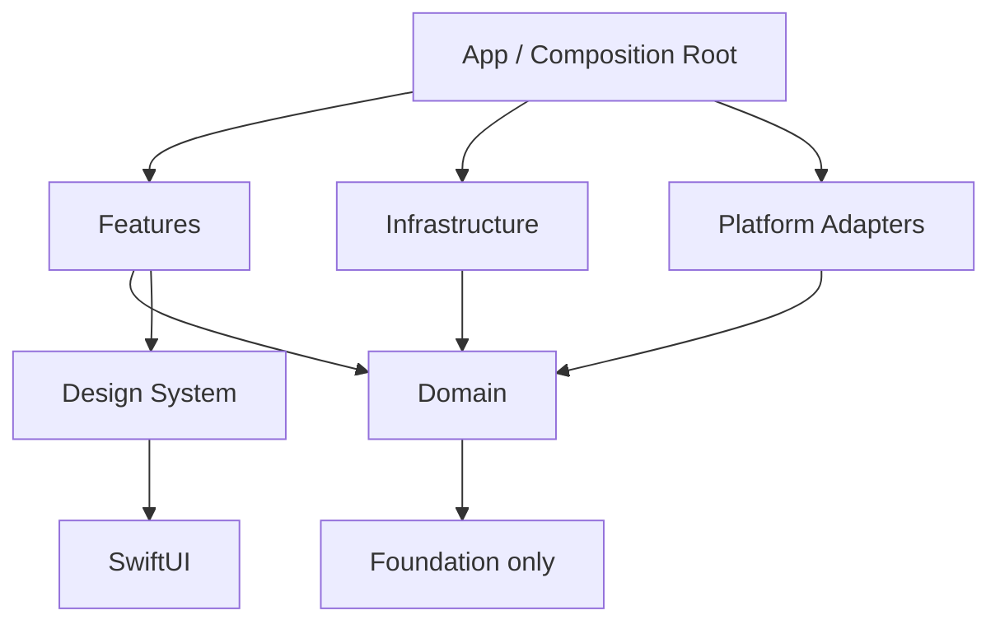
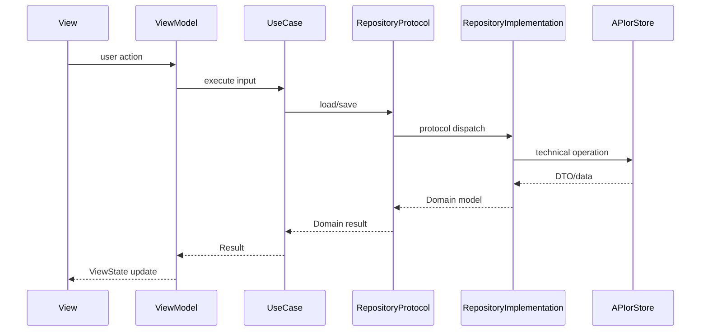

# Architekturkonzept für Cujana

Status: **verbindlicher Startpunkt**  
Geltungsbereich: **iOS-App für iPhone und iPad inklusive Mac Catalyst**<br>
Primäres Ziel: **wartbar, einfach verständlich, automatisch überprüfbar**

## 1. Kurzfassung

Cujana wird als **SwiftUI-first iOS-App mit modular-monolithischer Struktur** gebaut. Mac Catalyst ist Teil dieser Plattformentscheidung, damit die iPad-orientierte App auch auf macOS gebaut und getestet werden kann.

Das bedeutet:

- Es gibt **keine Cross-Platform-Abstraktion** für Android, Web, Flutter, React Native oder Kotlin Multiplatform.
- Mac Catalyst ist erlaubt; native macOS- oder visionOS-Targets gehören nicht zur unterstützten Produktmatrix.
- Die App bleibt zunächst in einem verständlichen iOS-Codebestand statt in vielen kleinen Modulen.
- Der Code wird nach **Features und klaren Verantwortlichkeiten** organisiert.
- Business-Logik ist unabhängig von SwiftUI, UIKit, Netzwerk, Persistenz und konkreten Apple-Frameworks.
- Architekturregeln werden durch Skripte, SwiftLint, CI und PR-Reviews enforced.

Der wichtigste Satz für jede Code-Entscheidung:

> UI zeigt Zustand an, ViewModels koordinieren, Use Cases enthalten App-Abläufe, Repositories kapseln Datenquellen, Infrastruktur implementiert Technik.

## 2. Architekturziele

### Muss-Ziele

1. **Einfach lesbar:** Neue Entwickler sollen nach wenigen Minuten wissen, wo Code hingehört.
2. **Wartbar:** Änderungen an UI, Netzwerk, Persistenz oder Fachlogik sollen möglichst lokal bleiben.
3. **Testbar:** Business-Logik soll ohne Simulator, Netzwerk und Datenbank testbar sein.
4. **iOS-nativ:** Cujana nutzt Swift, SwiftUI, iPadOS und Mac Catalyst direkt statt Cross-Platform-Komplexität.
5. **Enforced:** Die Architektur ist nicht nur Dokumentation, sondern wird automatisch geprüft.

### Nicht-Ziele

- Kein VIPER, kein überdimensioniertes Clean-Architecture-Zeremoniell.
- Keine abstrakte Multi-Plattform-Schicht „für später“.
- Keine globalen Service-Locator oder Singleton-Sammlungen.
- Keine Feature-Module nur um der Modularisierung willen.

## 3. Leitentscheidung

**Entscheidung:** Cujana startet als iOS-fokussierter modularer Monolith mit Mac-Catalyst-Unterstützung.

Ein modularer Monolith heißt hier:

- Ein App-Codebestand.
- Klare Ordner- und Abhängigkeitsregeln.
- Features sind sauber getrennt.
- Spätere Swift-Packages sind möglich, aber nur wenn echte Skalierungsprobleme auftreten.

Warum nicht sofort viele Module?

- Kleine Apps werden durch zu frühe Modulgrenzen langsamer und schwerer verständlich.
- Architektur soll den Alltag vereinfachen, nicht zusätzliche Arbeit erzeugen.
- Die Regeln unten erzeugen bereits klare Grenzen; physische Module können später daraus entstehen.

## 4. Zielstruktur im Repository

```text
Cujana/
  App/
    CujanaApp.swift
    Composition/
      AppDependencies.swift
      DependencyEnvironment.swift
    Navigation/
      AppRoute.swift
      AppRouter.swift

  Features/
    <FeatureName>/
      <FeatureName>View.swift
      <FeatureName>ViewModel.swift
      <FeatureName>UseCases.swift        # nur wenn das Feature eigene Abläufe braucht
      <FeatureName>Models.swift          # nur Feature-spezifische Presentation Models
      Components/

  Domain/
    Entities/
    ValueObjects/
    UseCases/
    Repositories/                        # Protokolle, keine Implementierungen
    Errors/

  Infrastructure/
    Network/
    Persistence/
    Repositories/                        # Implementierungen der Domain-Protokolle
    SystemServices/

  DesignSystem/
    Components/
    Tokens/
    Modifiers/

  Platform/
    UIKitAdapters/
    AppleFrameworkAdapters/

CujanaTests/
  DomainTests/
  FeatureTests/
  InfrastructureTests/

CujanaUITests/

docs/architecture/
scripts/
.cujana/
.github/
```

Diese Struktur ist eine Zielstruktur. Am Anfang müssen leere Ordner nicht künstlich angelegt werden. Sobald Code entsteht, gilt der Pfadvertrag.

## 5. Schichten und Verantwortlichkeiten



### App

Enthält den Einstiegspunkt, App-weite Komposition, Navigation und Dependency Wiring.

Erlaubt:

- `@main` App-Struktur
- globale App-Konfiguration
- Erzeugung echter Repository-Implementierungen
- Übergabe von Dependencies an Features
- App-weite Navigation

Nicht erlaubt:

- Fachlogik
- direkte Netzwerklogik in Views
- direkte Persistenzlogik in Views

### Features

Ein Feature enthält genau den Code, den ein Nutzer als zusammengehörigen Bereich erleben würde.

Erlaubt:

- SwiftUI Views
- ViewModels / Presentation State
- Feature-spezifische Komponenten
- Aufruf von Use Cases oder Repository-Protokollen
- Mapping von Domain-Modellen in UI-Zustand

Nicht erlaubt:

- direkte Verwendung von `URLSession`
- direkte Verwendung von `UserDefaults`, SwiftData, CoreData oder Keychain
- Implementierung von Repository-Protokollen
- Zugriff auf andere Feature-Interna

### Domain

Die Domain ist der stabilste Teil der App.

Erlaubt:

- Entities
- Value Objects
- Use Cases
- Repository-Protokolle
- fachliche Fehler
- reine Validierungen und Regeln

Nicht erlaubt:

- `SwiftUI`
- `UIKit`
- `SwiftData`
- `CoreData`
- `URLSession`
- App-Navigation
- konkrete Persistenz- oder Netzwerkdetails

### Infrastructure

Infrastruktur implementiert technische Details hinter Domain-Protokollen.

Erlaubt:

- API-Clients
- Repository-Implementierungen
- DTOs
- Mapper zwischen DTOs und Domain
- Persistenzimplementierungen
- Keychain, UserDefaults, SwiftData, File-System, URLSession

Nicht erlaubt:

- SwiftUI Views
- Feature-UI-Logik
- Navigation
- direkte Fachentscheidungen, die in die Domain gehören

### DesignSystem

Gemeinsame visuelle Bausteine.

Erlaubt:

- wiederverwendbare SwiftUI-Komponenten
- Farben, Spacing, Typografie
- View Modifier
- Preview-Daten für visuelle Komponenten

Nicht erlaubt:

- Feature-Fachlogik
- Netzwerk
- Persistenz
- App-Navigation

### Platform

Kapselt iOS-/Apple-spezifische Brücken, die nicht direkt in Features gehören.

Erlaubt:

- UIKit-Adapter
- Photos-, Location-, Notification-, Camera-, Share-Sheet-Brücken
- Wrapper um schwer testbare Apple APIs

Nicht erlaubt:

- Feature-Fachlogik
- direkter View-Zugriff aus der Domain

## 6. Abhängigkeitsregeln

| Von | Darf abhängen von | Darf nicht abhängen von |
|---|---|---|
| `App` | `Features`, `Infrastructure`, `Domain`, `DesignSystem`, `Platform` | Feature-Interna umgehen |
| `Features` | `Domain`, `DesignSystem` | `Infrastructure`, konkrete Persistenz, konkrete Netzwerkclients |
| `Domain` | `Foundation` | `SwiftUI`, `UIKit`, `SwiftData`, `CoreData`, `URLSession` |
| `Infrastructure` | `Domain`, `Foundation`, technische Apple APIs | `Features`, SwiftUI Views |
| `DesignSystem` | `SwiftUI`, `Foundation` | `Domain` nur wenn zwingend und per ADR entschieden |
| `Platform` | `Foundation`, Apple Frameworks, optional `Domain`-Protokolle | `Features` |

Richtung: **außen kennt innen, innen kennt außen nicht**.

## 7. Feature-Aufbau

Ein typisches Feature sieht so aus:

```text
Features/Profile/
  ProfileView.swift
  ProfileViewModel.swift
  ProfileUseCases.swift
  ProfileModels.swift
  Components/
    AvatarView.swift
```

### View

Views sind deklarativ und möglichst klein.

Sie dürfen:

- Zustand anzeigen
- Nutzeraktionen an das ViewModel weitergeben
- lokale UI-only Zustände halten, zum Beispiel Fokus oder Sheet-Sichtbarkeit

Sie dürfen nicht:

- Netzwerk aufrufen
- Persistenz aufrufen
- Business-Regeln enthalten
- globale Singletons lesen

### ViewModel

ViewModels koordinieren UI-Zustand und App-Abläufe.

Sie dürfen:

- Use Cases aufrufen
- Loading-, Empty-, Error- und Content-State verwalten
- Domain-Modelle in UI-Modelle mappen
- Tasks starten und abbrechen

Sie dürfen nicht:

- konkrete Repository-Implementierungen erzeugen
- direkt `URLSession` oder Persistenz verwenden
- komplexe Fachregeln enthalten, die testbar in Use Cases gehören

### Use Case

Use Cases beschreiben konkrete App-Abläufe.

Beispiele:

- `LoadProfileUseCase`
- `SaveDraftUseCase`
- `SearchItemsUseCase`

Ein Use Case ist sinnvoll, wenn mindestens eines gilt:

- Mehr als ein Repository wird koordiniert.
- Es gibt fachliche Bedingungen.
- Der Ablauf wird von mehreren Screens genutzt.
- Der Ablauf soll isoliert getestet werden.

Für triviale Weiterleitungen wird kein Use Case erzwungen.

## 8. Dependency Injection

Cujana verwendet **explizite Constructor Injection** plus eine kleine App-weite Dependency-Struktur.

Beispiel:

```swift
struct AppDependencies {
    let profileRepository: ProfileRepository
}

@Observable
final class ProfileViewModel {
    private let repository: ProfileRepository

    init(repository: ProfileRepository) {
        self.repository = repository
    }
}
```

Regeln:

- Keine `static let shared`-Singletons für App-Services.
- Keine versteckten Service-Locator in Feature-Code.
- Echte Implementierungen werden in `App/Composition` erzeugt.
- Tests übergeben Fakes oder In-Memory-Implementierungen.

## 9. Navigation

Navigation bleibt SwiftUI-nativ und typisiert.

Grundprinzip:

```swift
enum AppRoute: Hashable {
    case profile(id: Profile.ID)
    case settings
}
```

Regeln:

- Routen sind Werte, keine Strings.
- Feature-Views navigieren nicht über globale Singletons.
- App-weite Navigation liegt in `App/Navigation`.
- Feature-lokale Navigation darf im Feature bleiben, solange sie nicht von außen relevant ist.

## 10. Datenfluss



Rückgabewerte von Repositories sind Domain-Modelle oder klar definierte Fehler, keine rohen DTOs.

## 11. Fehlerbehandlung

Regeln:

- Domain-Fehler sind fachlich benannt.
- Infrastrukturfehler werden in Domain- oder App-Fehler gemappt.
- UI zeigt nutzerfreundliche Texte, keine technischen Fehlermeldungen.
- Fehlerzustand ist Teil des ViewState.

Beispiel:

```swift
enum ProfileError: Error, Equatable {
    case notFound
    case offline
    case unauthorized
}
```

## 12. Persistenz

Persistenz ist eine technische Entscheidung und bleibt hinter Repository-Protokollen.

Erlaubte Startregel:

- Kleine Einstellungen: über gekapselten Store in `Infrastructure/Persistence`.
- Strukturierte lokale Daten: SwiftData nur hinter Repository-Implementierungen.
- Secrets/Tokens: Keychain nur hinter Adapter.

Nicht erlaubt:

- `UserDefaults.standard` direkt in Views oder ViewModels.
- SwiftData-Queries direkt in Feature-Views, außer ein ADR erlaubt es explizit für ein sehr kleines, isoliertes Feature.
- Persistenzmodelle als Domain-Modelle missbrauchen.

## 13. Netzwerk

Netzwerkzugriff liegt ausschließlich in `Infrastructure/Network` oder Repository-Implementierungen.

Regeln:

- Kein `URLSession.shared` in Features.
- DTOs bleiben in Infrastructure.
- Mapping DTO → Domain ist explizit.
- API-Clients sind austauschbar testbar.
- Retry, Auth und Logging werden zentral gelöst, nicht pro Screen kopiert.

## 14. Nebenläufigkeit

Regeln:

- Neue asynchrone APIs verwenden `async/await`.
- UI-gebundene ViewModels laufen auf `@MainActor`, wenn sie UI-State verändern.
- Lange Arbeit wird nicht mit `Task.detached` aus Views gestartet.
- Cancellation wird in ViewModels berücksichtigt.
- Gemeinsamer mutable State wird vermieden oder über Actors geschützt.

## 15. Tests

Testpyramide:

```text
Viele schnelle Unit Tests
Einige Integration Tests
Wenige UI Tests für kritische Flows
```

### Unit Tests

- Domain-Use-Cases
- ViewModel-Zustandsübergänge
- Mapper
- Validierungen

### Integration Tests

- Repository-Implementierung mit Fake-API oder In-Memory-Store
- API-Client-Decoding
- Persistenz-Migrationen

### UI Tests

- kritische Nutzerpfade
- Login/Onboarding, falls vorhanden
- Hauptfluss der App

Regeln:

- Neue Fachlogik braucht Unit Tests.
- Bugs werden mit Regression Tests abgesichert.
- Tests nutzen Fakes statt echter Netzwerke.
- Swift Testing ist bevorzugt für neue Unit Tests.
- XCTest bleibt für UI Tests und Performance Tests zulässig.

## 16. Externe Dependencies

Neue externe Dependencies sind teuer. Sie erhöhen Update-, Security-, Lizenz- und Build-Aufwand.

Eine neue Dependency braucht ein ADR, wenn sie:

- produktiven App-Code betrifft,
- Netzwerk, Persistenz, Navigation, DI, Analytics oder UI-Grundlagen betrifft,
- mehr als ein Feature beeinflusst,
- schwer zu entfernen wäre.

Kriterien für Annahme:

- klarer Nutzen gegenüber Bordmitteln,
- aktive Wartung,
- kompatible Lizenz,
- einfache Austauschbarkeit,
- keine Architekturregeln werden unterlaufen.

## 17. Enforcement auf einen Blick

Die Architektur wird durch mehrere Ebenen geschützt:

1. **Pfadvertrag:** Code muss in passende Ordner.
2. **Dependency-Regeln:** Domain bleibt sauber, Features greifen nicht direkt auf Infrastruktur zu.
3. **Skript:** `scripts/check_architecture.sh` prüft verbotene Imports und Muster.
4. **SwiftLint:** `.swiftlint.yml` prüft Stil und zusätzliche Architekturregeln.
5. **CI:** `.github/workflows/architecture-guardrails.yml` führt Checks automatisch aus.
6. **PR-Template:** Änderungen müssen Architekturauswirkung explizit beantworten.
7. **CODEOWNERS:** Architekturdateien brauchen Review durch Owner.
8. **ADR-Prozess:** Größere Architekturänderungen werden nachvollziehbar dokumentiert.

Details stehen in [enforcement.md](enforcement.md).

## 18. Wann wird modularisiert?

Swift Packages oder getrennte Targets werden erst eingeführt, wenn mindestens zwei Bedingungen erfüllt sind:

- Build-Zeiten oder Teamarbeit leiden messbar.
- Eine Grenze ist fachlich stabil.
- Ein Feature hat wenige Abhängigkeiten und klare Public API.
- Tests profitieren deutlich von separater Kompilierung.

Vorher reichen Ordnergrenzen plus CI-Regeln.

## 19. Definition of Done für neue Features

Ein Feature ist fertig, wenn:

- Code im richtigen Feature-Ordner liegt.
- UI, ViewModel, Domain und Infrastruktur nicht vermischt sind.
- Keine verbotenen direkten Zugriffe auf Netzwerk/Persistenz existieren.
- Relevante Unit Tests vorhanden sind.
- Fehler-, Loading- und Empty-State bewusst behandelt sind.
- `make architecture-check` grün ist.
- Architekturabweichungen per ADR begründet sind.

## 20. Entscheidungsregel bei Unsicherheit

Wenn unklar ist, wo Code hingehört:

1. Ist es sichtbare UI? → `Features` oder `DesignSystem`.
2. Ist es fachliche Regel? → `Domain`.
3. Ist es technischer Zugriff auf System, Netzwerk oder Speicher? → `Infrastructure` oder `Platform`.
4. Verbindet es echte Implementierungen miteinander? → `App/Composition`.
5. Wird es von mehreren Features gebraucht? → erst prüfen, ob es wirklich generisch ist; dann `Domain`, `DesignSystem` oder ein bewusst benanntes Shared-Konzept.

Nicht in einen allgemeinen `Helpers`-, `Managers`- oder `Services`-Ordner ausweichen.
