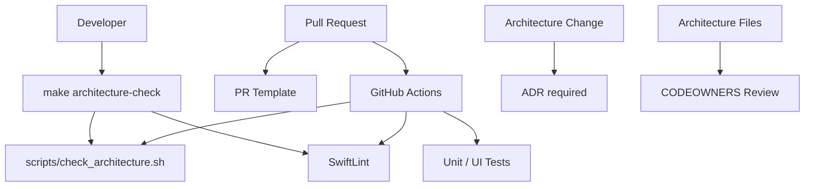

# Architektur-Enforcement

Status: **verbindlich**  
Ziel: Architektur soll nicht nur beschrieben, sondern automatisch geschützt werden.

## 1. Prinzip

Cujana verwendet mehrere kleine, verständliche Guardrails statt eines großen, schwer wartbaren Regelwerks.

Die Regeln sollen:

- früh brechen,
- lokal ausführbar sein,
- ohne Spezialwissen verständlich sein,
- mit klarer Fehlermeldung erklären, was zu tun ist,
- bewusst per ADR änderbar sein.

## 2. Enforcement-Ebenen



## 3. Lokale Pflichtprüfung

Vor jedem Pull Request:

```bash
make architecture-check
```

Diese Prüfung ruft aktuell auf:

```bash
./scripts/check_architecture.sh
swiftlint lint --strict   # wenn SwiftLint installiert ist
```

Das Bash-Skript ist bewusst dependency-free. Es funktioniert auch, bevor ein vollständiges Xcode-Projekt existiert.

## 4. Was das Skript prüft

`scripts/check_architecture.sh` prüft unter anderem:

- `Domain` importiert kein `SwiftUI`, `UIKit`, `SwiftData` oder `CoreData`.
- `Features` verwenden kein direktes `URLSession`, `UserDefaults`, SwiftData oder CoreData.
- `View.swift`-Dateien enthalten keine direkte Netzwerk- oder Persistenzlogik.
- `UIKit` ist nur in `Platform`, expliziten Adaptern oder Tests erlaubt.
- `Infrastructure` importiert keine Feature-Views.
- `Manager`-Klassen werden verhindert.
- `static let shared` wird verhindert, um Singleton-Wildwuchs zu vermeiden.
- `try!` und `as!` werden verhindert.
- Testdateien mischen nicht `Testing` und `XCTest` im selben File.
- Änderungen an Dependencies oder Architekturregeln brauchen ein ADR, wenn CI einen Vergleich zu `origin/main` herstellen kann.

## 5. SwiftLint

SwiftLint ergänzt das Skript mit Stil- und Regex-Regeln.

Wichtig: SwiftLint ist nicht die einzige Durchsetzung. Die Architekturregeln müssen auch dann grob greifen, wenn SwiftLint lokal nicht installiert ist. Deshalb bleibt das Bash-Skript die minimale Pflichtprüfung.

## 6. CI-Gate

GitHub Actions führt bei Pull Requests und Pushes aus:

1. Architektur-Skript
2. SwiftLint
3. Swift Package Tests, falls `Package.swift` vorhanden ist
4. Xcode Tests, sobald ein Xcode-Projekt und ein Shared Scheme existieren

Ein Pull Request wird erst gemerged, wenn die Guardrails grün sind.

## 7. PR-Template

Das PR-Template zwingt zu kurzen Antworten auf diese Fragen:

- Welche Schicht wurde geändert?
- Gibt es neue Dependencies?
- Gibt es Architekturabweichungen?
- Wurde ein ADR ergänzt?
- Sind Tests vorhanden?

Diese Fragen sind absichtlich kurz. Ziel ist Nachvollziehbarkeit, nicht Bürokratie.

## 8. CODEOWNERS

Architekturkritische Dateien erfordern Review durch den Repo-Owner:

- `docs/architecture/**`
- `.cujana/**`
- `scripts/check_architecture.sh`
- `.swiftlint.yml`
- `.github/workflows/**`
- `Configuration/**`

So können Regeln nicht nebenbei abgeschwächt werden.

## 9. ADR-Pflicht

Ein ADR ist Pflicht bei Änderungen an:

- Plattformziel oder Minimum-iOS-Version
- Schichtenmodell
- Navigation
- Dependency Injection
- Persistenztechnologie
- Netzwerk-Grundstruktur
- externer Dependency im produktiven Code
- CI-/Lint-Regeln, die Architektur betreffen
- Abweichungen von Pfad- oder Importregeln

ADR-Dateien liegen in:

```text
docs/architecture/adr/
```

## 10. Ausnahmen

Ausnahmen sind erlaubt, aber nie stillschweigend.

Eine Ausnahme braucht:

1. Kommentar im Code, warum sie nötig ist.
2. Ticket oder ADR-Verweis.
3. Möglichst kleinen Scope.
4. Entfernbarkeitsplan, wenn es technischer Schuldencharakter ist.

Beispiel:

```swift
// Architecture exception: UIKit bridge is isolated here. See ADR-0003.
import UIKit
```

## 11. Fitness Functions

Eine Architekturregel wird nur eingeführt, wenn sie eine konkrete Fehlentwicklung verhindert.

Gute Fitness Function:

- „Features dürfen kein `URLSession` verwenden.“
- „Domain darf kein SwiftUI importieren.“
- „Neue produktive Dependencies brauchen ADR.“

Schlechte Fitness Function:

- „Code muss schön sein.“
- „Alles muss Clean Architecture sein.“
- „Jede Klasse braucht ein Protokoll.“

## 12. Review-Regeln

Reviewer achten besonders auf:

- Wurde Fachlogik in Views geschrieben?
- Gibt es direkte Infrastrukturzugriffe aus Features?
- Entstehen neue Singletons?
- Ist der Code einfacher als die Alternative?
- Wurden Namen gewählt, die Fachlichkeit ausdrücken statt generische Technik?
- Sind Tests auf der richtigen Ebene?

## 13. Regeländerungen

Wenn eine Regel zu streng ist:

1. Nicht einfach löschen.
2. Konkreten Fall beschreiben.
3. ADR ergänzen.
4. Regel enger fassen statt komplett entfernen.
5. CI muss nach der Änderung weiterhin klare Grenzen prüfen.

## 14. Startzustand

Da Cujana als neues Repository startet, können Guardrails bereits vor der ersten App-Datei vorhanden sein. Das ist gewollt: Die erste Implementierung wächst dann direkt in die richtige Form hinein.
